# Clase 1: del dato a la persistencia

En esta clase se recorre un flujo completo y mínimo: un sensor genera un dato, el dato ingresa por una API, PostgreSQL lo persiste y luego la API permite recuperarlo. El objetivo es observar el recorrido **dato → ingreso → persistencia → base de datos → recuperación**, no profundizar todavía en SQL ni en modelado de datos.

## Arquitectura



Fuente editable: [`arquitectura.mmd`](docs/diagrams/arquitectura.mmd).

Los endpoints pertenecen al **backend FastAPI**. El sensor y el usuario se comunican con la API mediante HTTP; solamente el backend ejecuta SQL para guardar o recuperar mediciones en PostgreSQL. Las respuestas vuelven al cliente como JSON.

Docker Compose ejecuta tres servicios: `postgres`, `backend` y `pgadmin` (interfaz web para inspeccionar la base de datos). El simulador se ejecuta desde la computadora anfitriona.

## Requisitos

- Docker con el complemento Docker Compose.
- Python 3 para ejecutar el simulador.
- `curl` para probar la API desde una terminal.

Todos los comandos siguientes parten desde el directorio de la práctica:

```bash
cd clase-01/practica
```

## 1. Preparar y levantar el entorno

Crear el archivo local de configuración y levantar los servicios:

```bash
cp .env.example .env
docker compose up -d
docker compose ps
```

Cuando ambos servicios estén listos, comprobar la API y su conexión con PostgreSQL:

```bash
curl http://localhost:8000/health
```

Respuesta esperada:

```json
{"status":"ok","database":"connected"}
```

## 2. Ingresar una medición

Publicar manualmente un dato de sensor:

```bash
curl -X POST http://localhost:8000/measurements \
  -H 'Content-Type: application/json' \
  -d '{
    "device_id": "sensor-aula-01",
    "timestamp": "2026-08-21T14:30:00Z",
    "temperature": 24.6,
    "humidity": 51.2,
    "pressure": 1012.8
  }'
```

La API responde con estado HTTP `201 Created`, la medición almacenada, su `id` y `created_at`. `pressure` es el único valor opcional.

## 3. Recuperar el histórico

Obtener hasta 100 mediciones, de la más reciente a la más antigua:

```bash
curl 'http://localhost:8000/measurements'
```

Filtrar por dispositivo y limitar el resultado:

```bash
curl 'http://localhost:8000/measurements?device_id=sensor-aula-01&limit=5'
```

El histórico vacío se representa con `200 OK` y una lista vacía (`[]`). El orden usa `timestamp` descendente y, si dos mediciones tienen el mismo instante, `id` descendente como desempate estable.

## 4. Recuperar la última medición

Obtener la última medición entre todos los dispositivos:

```bash
curl 'http://localhost:8000/measurements/latest'
```

Obtener la última medición de un dispositivo específico:

```bash
curl 'http://localhost:8000/measurements/latest?device_id=sensor-aula-01'
```

Si no existe ninguna medición para el alcance solicitado, la API responde `404 Not Found` con `{"detail":"No measurements found"}`. Este endpoint usa el mismo orden que el histórico.

## 5. Ejecutar el sensor simulado

El simulador utiliza únicamente la biblioteca estándar de Python. El siguiente comando publica exactamente cinco mediciones del dispositivo `sensor-aula-02`, con un intervalo de un segundo:

```bash
python3 simulator/sensor_simulator.py \
  --device-id sensor-aula-02 \
  --url http://localhost:8000 \
  --interval 1 \
  --count 5
```

Cada medición genera aleatoriamente temperatura entre 20 y 30 °C, humedad entre 35 y 80 %, y presión entre 990 y 1030 hPa.

## 6. Comprobar la persistencia

Detener y eliminar los contenedores sin eliminar el volumen:

```bash
docker compose down
docker compose up -d
```

Consultar nuevamente el histórico:

```bash
curl 'http://localhost:8000/measurements?limit=10'
```

Los datos continúan disponibles porque PostgreSQL los guarda en el volumen nombrado `postgres_data`, independiente del ciclo de vida de los contenedores.

Para eliminar deliberadamente contenedores **y datos persistidos**:

```bash
docker compose down -v
```

El siguiente `docker compose up -d` creará un volumen vacío y volverá a ejecutar `database/init/01-init.sql`.

## 7. Observar los datos con pgAdmin

pgAdmin permite inspeccionar la tabla `measurements` desde el navegador, sin escribir SQL manualmente.

obtener los valores de usuario y contraseña del `.env` para poder acceder al servicio:

```bash
PGADMIN_USER=tu_email@ejemplo.com
PGADMIN_PASSWORD=una_password
PGADMIN_PORT=5050
```

`PGADMIN_USER` debe tener formato de email: pgAdmin lo exige como usuario de acceso.

Abrir [http://localhost:5050](http://localhost:5050) e iniciar sesión con `PGADMIN_USER` y `PGADMIN_PASSWORD`.

Registrar el servidor de PostgreSQL (una sola vez):

1. Click derecho en **Servers** → **Register** → **Server...**
2. Pestaña **General** → **Name**: `ceiot-clase-01` (o el nombre que prefieras).
3. Pestaña **Connection**:
   - **Host name/address**: `postgres` (el nombre del servicio en la red de Docker Compose, no `localhost`).
   - **Port**: `5432`.
   - **Maintenance database**: el valor de `POSTGRES_DB`.
   - **Username**: el valor de `POSTGRES_USER`.
   - **Password**: el valor de `POSTGRES_PASSWORD`.
4. Guardar.

Para ver los datos: **Servers** → tu servidor → **Databases** → tu base → **Schemas** → **public** → **Tables** → `measurements` → click derecho → **View/Edit Data** → **All Rows**.

Los datos persisten entre reinicios del contenedor `pgadmin` gracias al volumen nombrado `pgadmin_data`, salvo que se ejecute `docker compose down -v`.

## Qué observar

- El dato se origina fuera del backend.
- La API valida la forma del dato antes de enviarlo a PostgreSQL.
- La tabla `measurements` conserva el dato aunque los contenedores se vuelvan a crear.
- `timestamp` representa cuándo ocurrió la medición; `created_at`, cuándo fue persistida.
- La recuperación puede responder una colección histórica o una única medición reciente.

